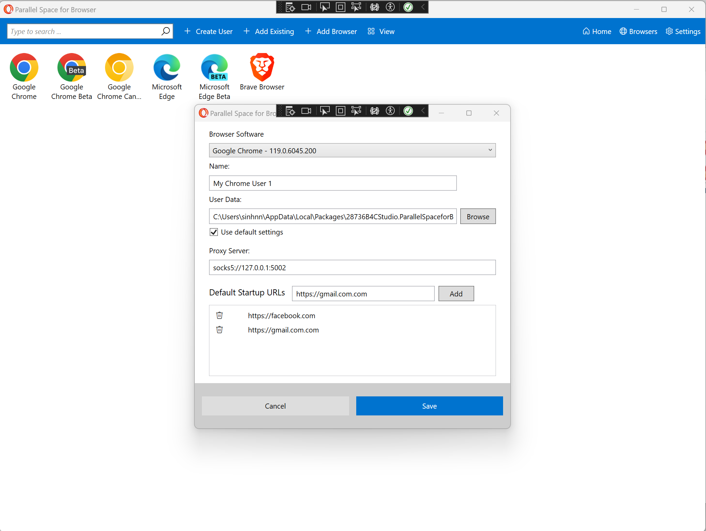
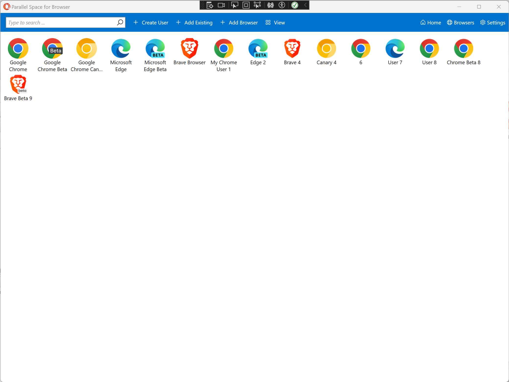
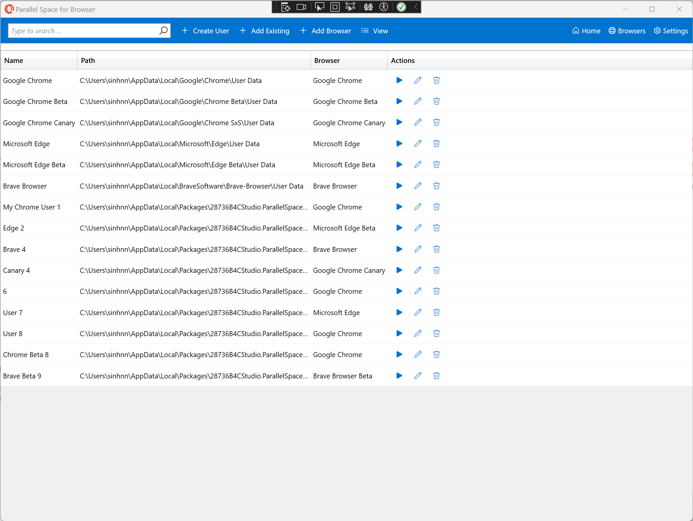
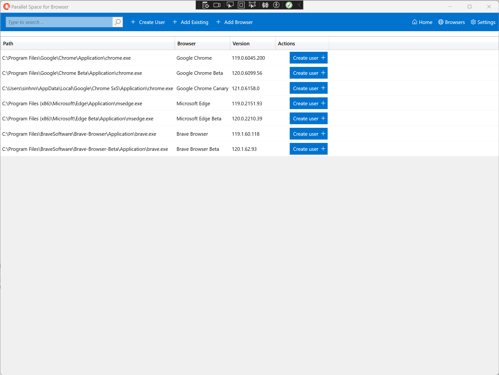
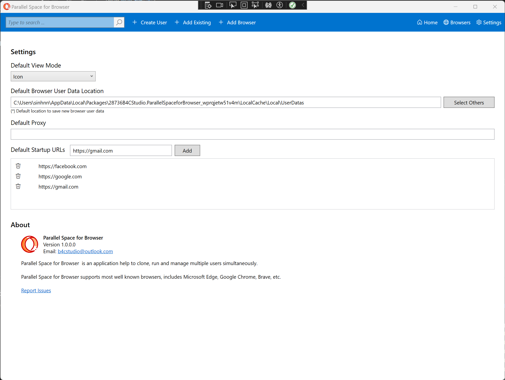

# ParallelSpaceForBrowser
Parallel Space for Browser is an application help to clone, run and manage multiple users. It supports most well known browsers, includes Microsoft Edge, Google Chrome, Brave, etc.

## Features
Parallel Space for Browser supports many most well known browsers, includes Microsoft Edge, Google Chrome, Brave, etc.
  - Separate space for each user
  - Supports starts with proxy: http,https,socks5
  - Support starts with list of your websites
  - Friendly interface
  - Easy to manage hundred users

## Screenshot and Media

 
 
 
 
 

## Download and Installation
Parallel Space for Browser is available Microsft Store only at https://www.microsoft.com/store/apps/9N0N9V0VCV9V

## Privacy
The application Parallel Space for Browser (now called application) an application helps to transfer browser data between computers.

What Data We Collect and Process: The application Parallel Space for Browser does not collect, store or transit any personal personal data. 
The app does not use any own telemetry functions apart from the standardised telemetry functions by Microsoft (crashes, install from which country, versions in use, custom events etc.)